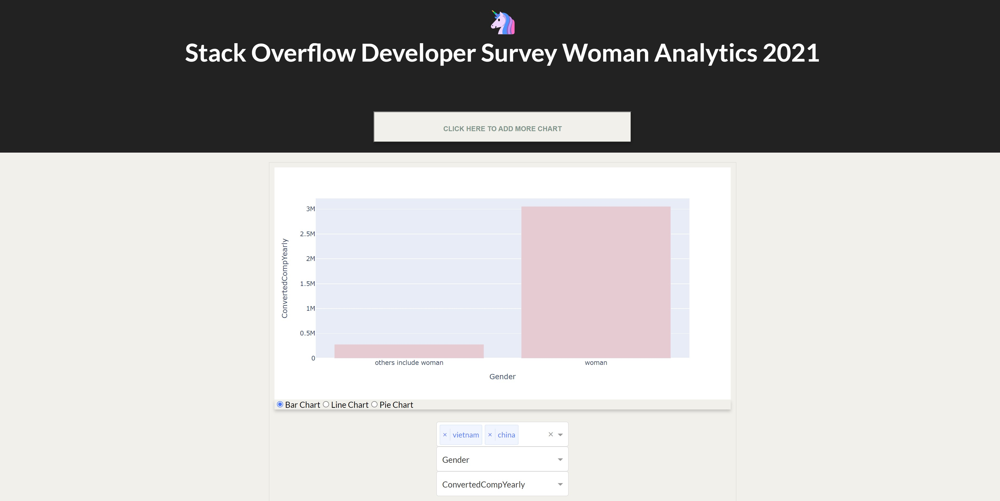
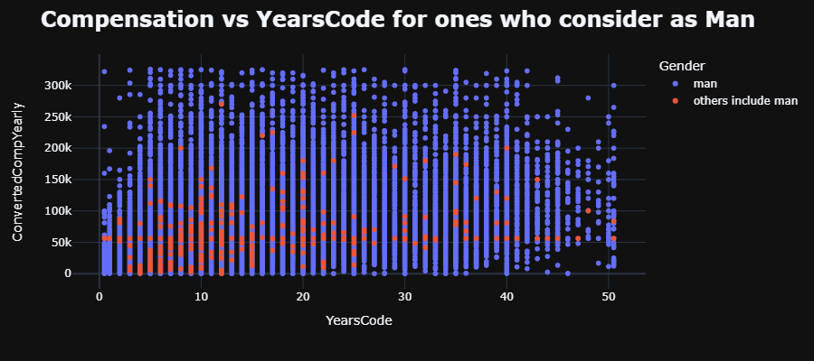
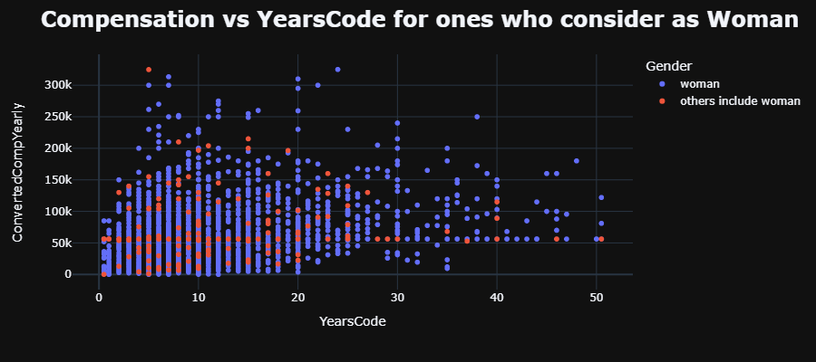

# Data Exploration




## Overview


## Business Problem

## Data
[Stack Overflow Developer Survey](https://insights.stackoverflow.com/survey) Results 2021 dataset


## Methods

This project uses descriptive analysis, including description of trends over time. This provides a useful overview of Stack Over Flow users and outcomes to identify the gender inequality in Tech field


## Results
+ More Vietnamese men than women answered the survey. Surprisingly the yearly compensation gap between men and women is significantly large (14,832,499 USD and 762,831 USD)

+ Most Vietnamese women respondents are not a member of other online developer communities besides Stack Overflow in 2021

+ Older age respondents are more likely to be a member of other online developer communities. This might be because they need more resources to serve their professional work.

+ The most famous operating system in Vietnam for those who responded to the survey is Window. This might be the diversity in the price range of these devices.

+ The higher number of years of coding including education ( or years of professional coding not including education), the higher the yearly compensation is. 

+ Most Vietnamese women responded to the survey work in organization size around 20-99 employees, and their highest average compensation yearly is 56.211k USD

+ The most popular language in 2021 is JavaScript

+ The highest median yearly compensation of all the respondents is San Marino, USA only takes second place

+ Most respondents in this survey are not belong to any online developer communities besides Stack Over Flow

+ Over half of the respondents hold a bachelor's, so most programmers seem to have some formal education. However, it's not clear whether they hold a degree in computer science.

+ Web developer seems to get the most popular: first is full stack, then front and back end developer. 

+ Most of the respondents are man (91.78%)

+ Women tend to have a coding career length shorter than men


## Conclusions
+ I would recommend Stack Overflow to increase the inclusivity by translating the survey into multiple languages.
## For More Information
See the full analysis in the [Dash interactive DashBoard]() 


python version 3.8.8

# Option 1: WORKING ON YOUR LOCAL COMPUTER

1. Install Conda
   by [following these instructions](https://conda.io/projects/conda/en/latest/user-guide/install/index.html). Add Conda
   binaries to your system `PATH`, so you can use the `conda` command on your terminal.

2. Install jupyter lab and jupyter notebook on your terminal

+ `pip install jupyterlab`
+ `pip install jupyter notebook`

### Jupyter Lab

1. Download the github zipped project folder or clone the github repo. Unzip it by double-clicking on it.

2. In the terminal, navigate to the directory containing the project and install these packages and libraries

3. Enter the newly created directory using `cd directory-name` and start the Jupyter Lab.

```
jupyter lab

```

You can now access Jupyter's web interface by clicking the link that shows up on the terminal or by
visiting http://localhost:8888 on your browser.

4. Click on assignment1.ipynb in the browser tab. This will open up my main file in the Jupyter Lab.

5. Follow the steps in the Jupyter Lab. If you get to Task 4, you can look at `dash_as1.ipynb` for better understanding
of **Visualization Dashboard** before running the web app on the local machine.

### Note: If the Jupyter Notebook is not responding due to many requests

Error [(The page is not responding)](https://stackoverflow.com/questions/48615535/jupyter-notebook-takes-forever-to-open-and-then-pages-unresponsive-mathjax-i)

I had to restart the notebook; and it did not work. This is because I was printing out too much and the following
scripts resolved the issue by clear out all the output to run through the whole kernal:

1. `conda install -c conda-forge nbstripout` or `pip install nbstripout`

2. `nbstripout filename.ipynb`


### Deploying Dash Web App on the local machine

1. Enter the newly created directory using `cd directory-name` and start the Web App.

2. First create a **virtual environment** with conda or venv inside a temp folder, then activate it.

```
virtualenv venv

# Windows
py -m venv .env
.env\Scripts\activate

# Or Linux
source venv/bin/activate

```

3. Run the app

```

python app.py

```


# Option 2: RUNNING USING ONLINE RESOURCES (1-click)

The easiest way to start executing this notebook is to click the "Run" button at the top of this page, and select "Run
on Binder". This will run the notebook on [mybinder.org](https://mybinder.org), a free online service for running
Jupyter notebooks. You can also select "Run on Colab" or "Run on Kaggle".

You can access my full version of jupyter notebook here: 
+ **Task 1:** https://plotly.com/~tnathu/17/assignment-1-data-exploration-this-is/
+ **Task 1.8:** https://plotly.com/~tnathu/18/assignment-1-data-exploration-this-is/
+ **Task 2:** https://plotly.com/~tnathu/19/assignment-1-data-exploration-this-is/
+ **Task 4:** https://plotly.com/~tnathu/20/task-4-visualisation-dashboard-this-is/


## Demo:

The following are screenshots for the Dash visualizations in this repo:






## Productionization

In this step, I built a flask API endpoint that was hosted on a local webserver 


## Future improvement:

+ Labeling: For supervised learning, then I need to make sure that my labels are accurate. 

+ Feature space coverage: Ensure that my training dataset has examples that cover the same feature space as the request that my future model will receive. 

+ Minimal Dimensionality & Maximum predictive data: I also want to reduce the dimensionality of your feature vector to optimize my system performance while retaining or enhancing the predictive information on my data. 

+ Fairness:  I will need to consider and measure the fairness of my data and model, especially for rare conditions, for example, in this case, where gender inequality prerequisites may be critical to success. 


## Repository Structure

```
├── dash
│   ├── app.py
│   ├── .gitignore
│   ├── Procfile
│   └── requirements.txt
├── data
│   ├── survey_results_schema.csv
│   ├── survey_results_public.csv
│   ├── Procfile
│   └── requirements.txt
├── images
├── README.md
├── interactive_html
│   ├── ConvertedCompYearly_box_plot.html
│   ├── fig-animated-bar.html
│   ├── fig-Vietnames-woman-participation.html
│   └── fig-Vietnamese-compensation.html
│   ├── scatter-man.html
│   └── scatter-woman.html
└── cleaning.ipynb
└── encoding.ipynb
└── EDA.ipynb
└── dash_visualization.ipynb
└── jupyter_functions.py
```
